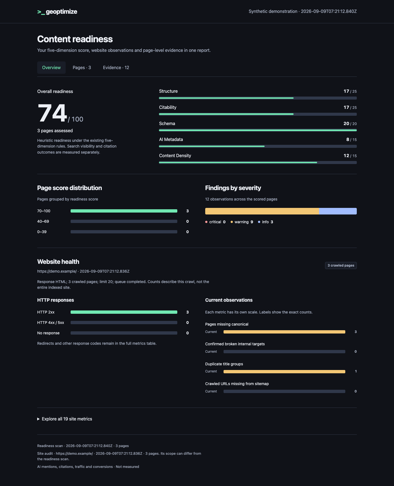
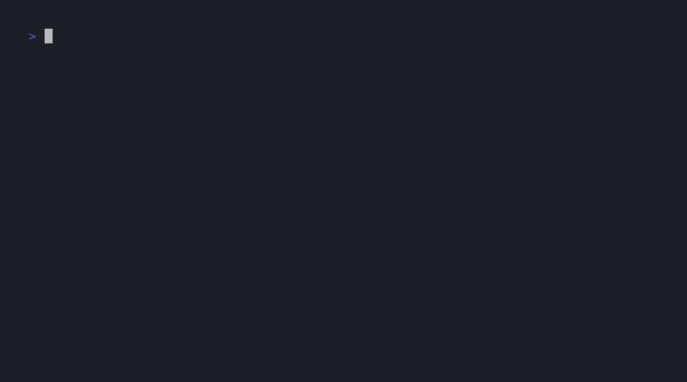

# geoptimize

**Formerly aeoptimize.** This is the same project, continued under the `geoptimize` name from version 0.8.0. Existing `aeoptimize` users can follow the [migration guide](https://github.com/cucuwang/geoptimize/blob/main/docs/migrating-from-aeoptimize.md).

[Current npm package](https://www.npmjs.com/package/geoptimize) · [Legacy npm package and download history](https://www.npmjs.com/package/aeoptimize) · [Last release under the old name](https://github.com/cucuwang/geoptimize/releases/tag/v0.7.0)

[](https://www.npmjs.com/package/geoptimize)
[](https://github.com/cucuwang/geoptimize/actions/workflows/ci.yml)
[](https://github.com/cucuwang/geoptimize/blob/main/LICENSE)

**AI crawlers read your pages before humans do. Lint them like code.**

`geoptimize` is a deterministic content-readiness lint for static websites and documentation. It checks reproducible properties such as document structure, sourced quantitative claims, structured-data hygiene, indexing controls, metadata quality, and repetitive wording — locally, in CI, or pre-commit.

[](docs/assets/report-demo.html)

[Open the offline example](docs/assets/report-demo.html) · [After improvements](docs/assets/report-demo-after.html)



It does **not** predict ranking, indexing, rich results, Google AI Overviews, or citation by ChatGPT, Perplexity, or another AI system. Google states that its AI search features need no special AI text file or schema, and valid structured data does not guarantee a search feature. See [methodology and limitations](docs/methodology.md).

## Quick start

Requires Node.js 22.12 or newer.

```bash
npm install --save-dev geoptimize
```

```bash
npx geoptimize scan https://example.com
npx geoptimize scan ./dist --dir
npx geoptimize scan ./dist --dir --json
npx geoptimize audit https://example.com --json
npx geoptimize audit-site https://example.com --max-pages 20 --json
```

Example output:

```text
Content Readiness Report
Score: 71/100

Structure        20/25
Citability       18/25
Schema           16/20
AI Metadata      10/15
Content Density   7/15
```

The score is a versioned heuristic for catching regressions within the same project. Do not treat it as a percentage chance of search or AI visibility, and do not compare unrelated sites as if it were an outcome metric.

## What is scored

| Dimension | Max | Scope |
| --- | ---: | --- |
| Structure | 25 | Document outline and readability heuristics |
| Citability | 25 | Claim specificity, source signals, definitions, attribution |
| Schema | 20 | JSON-LD structural hygiene when present; absence is not penalized |
| AI Metadata | 15 | Page-level indexing control and description quality |
| Content Density | 15 | Content/boilerplate and repetition heuristics |

Two often-promoted GEO signals are deliberately excluded from the score:

- FAQ content and `FAQPage` schema are optional. The generator does not infer FAQ schema from question headings.
- `llms.txt` is an experimental proposal. Generating or publishing it does not add points.

Every rule, its evidence class, and known false-positive boundary is documented in [docs/methodology.md](docs/methodology.md) and exercised by the [versioned public fixture corpus](fixtures/v0.6/rule-corpus.ts).

## Evidence-backed page audit

`audit` inspects one public URL or one local HTML/Markdown file. It is a separate, versioned contract and does not change the v0.6 readiness score or `scan --json` output.

```bash
npx geoptimize audit https://example.com
npx geoptimize audit ./dist/index.html --json
```

The first audit contract checks:

- HTTP status, final URL, and redirect evidence for URL targets;
- document title, meta description, headings, language, canonical, and page-level robots directives;
- discovered links, image alt attributes, and JSON-LD structural validity.

Each check returns `PASS`, `WARNING`, `FAIL`, or `N/A`, the observed evidence, an explanation, an optional remediation, and a validation step. `PASS` is bounded to the inspected evidence. It does not establish ranking, indexing, rich-result display, traffic, conversion, or AI citation.

The command intentionally reports unavailable site-wide and external measurements as limitations. It does not infer robots.txt policy, sitemap membership, hreflang reciprocity, broken-link status, Core Web Vitals, analytics, or actual search-engine index state from one page.

## Bounded site audit

`audit-site` follows same-origin links in deterministic order and stops at an explicit page limit. It reads robots.txt before subsequent page requests, discovers same-origin sitemap files, and uses response HTML without browser rendering.

```bash
npx geoptimize audit-site https://example.com
npx geoptimize audit-site https://example.com --max-pages 50 --json
```

The site contract reports bounded crawl coverage, robots policy, page status, redirect chains, internal link targets, canonical consistency, sitemap discrepancies, sitemap-only orphan candidates, and duplicate titles. Sitemap-only pages remain candidates until a sufficiently complete crawl or server-log evidence confirms their discovery state.

The default limit is 20 page requests and the accepted range is 1–200. Cross-origin page links are recorded only as counts, and subsequent redirects outside the audited origin are not followed. JavaScript-inserted links, actual search-engine crawl/index state, rankings, traffic, and conversions remain outside this contract.

## Visual report

Keep the original total and all five readiness dimensions together with page-score
and severity charts. Add site-audit data for HTTP charts, canonical/link/sitemap
observations, and baseline comparisons. Search individual pages or expand findings
to inspect evidence and suggested actions.

```bash
geo scan ./dist --dir --details --json > readiness.json
geo audit-site https://example.com --max-pages 50 --json > site.json
geo report readiness.json --site site.json --output report.html
# Add --baseline previous-readiness.json for score and source comparisons.
# Add --baseline-site previous-site.json for comparable site-count charts.
```

Detailed scans include original rule results and a source excerpt of up to 6000
characters per page. Review captured source before sharing. Reports without details
still open, with unavailable rule/source evidence labeled explicitly.

Click score distributions to filter pages, or a severity label to inspect those
scoring findings. Site finding controls expose the complete affected target list.
Open a dimension to inspect rule points and diagnostics. A compatible readiness
baseline adds total/dimension changes and captured before/after source excerpts.

Open the resulting HTML in a browser. It works offline with no external fonts,
scripts, or analytics. Existing output files are preserved; choose a new filename
for another report. The scoring algorithm is unchanged. Readiness and site audit
scope/timestamps remain visible because the two inputs can cover different pages.

The example reports use the same synthetic HTML for readiness and site audits.
In a repository checkout, generate them with `node scripts/prepare-metrics-demo.mjs <empty-directory>` after
building. Browser checks run with `node scripts/verify-visual-report.mjs <directory>`;
set `GEO_CHROME` to a Chrome executable on platforms outside macOS.

## Site metrics and scan comparisons

Summarize the site audit into 19 observed counts, including HTTP failures, redirects,
internal link targets, canonical findings, sitemap discrepancies and duplicate titles.
Save each scan to a new JSON file to retain its timestamp and evidence.

```bash
geo audit-site https://example.com --max-pages 50 --json > before.json
# After updating the site, scan the same URL with the same limit.
geo audit-site https://example.com --max-pages 50 --json > after.json
geo metrics after.json --baseline before.json
geo metrics after.json --baseline before.json --json
```

The comparison lists count differences and new, persisting, and no-longer-observed
findings. An absent observation needs evidence review before calling it a repair.
Changes in origin, start URL, page limit, crawled URL set, or metric evidence version
suppress deltas. Partial crawls, robots skips, unavailable requests, and a newer
baseline also suppress comparison. Absolute counts remain available.

Counts use complete evidence, even when the detailed audit displays only 20 sample
URLs. Older reports without complete counts display `Not measured`. Queue completion
is bounded discovery, so no whole-site coverage percentage is inferred. AI mentions,
citations, traffic and conversions require separate collection and remain unmeasured.

The terminal demo uses a synthetic three-page fixture with actual audit output.
To reproduce it after building, run `vhs docs/assets/demo.tape`. The preparation script
also accepts an empty output directory for inspecting readiness and site JSON reports plus the interactive HTML examples without VHS.

## How it compares

| | geoptimize | Lighthouse-style SEO audits | Hosted GEO platforms |
| --- | --- | --- | --- |
| Question it answers | Is this content machine-readable and citable? | Does the page pass classic SEO checks? | Did my AI visibility change this week? |
| Deterministic | Yes — versioned rules, fixture-tested | Partially | No — model output varies run to run |
| Runs where | Local CLI, CI, pre-commit hook, Vite/Next plugins | Browser / DevTools | Vendor cloud |
| Blocks regressions in CI | Yes, via a stable `--json` contract | Possible with extra wiring | Rarely |
| Cost | Free, MIT | Free | Varies by vendor |

Visibility trackers answer "did rankings change?". geoptimize answers the question you can act on in a pull request: "is this page ready?". The two compose rather than compete.

## CI contract

`--json` is the stable automation surface. A non-zero threshold is useful only after your team reviews the baseline and accepts the current methodology version.

```bash
npx geoptimize scan ./dist --dir --json > geoptimize-report.json
node -e "const r=require('./geoptimize-report.json'); process.exit(r.overall.total < 60 ? 1 : 0)"
```

The [GitHub Marketplace Action](https://github.com/marketplace/actions/geoptimize-content-readiness-check) is advisory by default. It reports findings without blocking the workflow:

```yaml
- uses: cucuwang/geoptimize@v0.9.0
  with:
    path: dist
```

Projects can explicitly choose blocking mode after accepting a baseline:

```yaml
- uses: cucuwang/geoptimize@v0.9.0
  with:
    path: dist
    fail-on-low-score: 'true'
    min-score: '60'
```

The Action exposes `score` and `report` outputs in both modes. Its release is reproducible only when the Action tag and matching npm package version both exist. Before pinning a version, verify both artifacts; if either is missing, use the CLI directly.

A copyable advisory workflow and controlled input are available in the [end-to-end Action sample](examples/github-action-sample/README.md).

## Audit built HTML before deployment

The `audit-build` command checks a local HTML file or build directory and reports evidence,
remediation and validation for each finding. It leaves the existing `scan` score and
JSON contract unchanged.

```bash
npx geoptimize audit-build ./dist --json
npx geoptimize audit-build ./dist --base-url https://example.com/ --expect-indexable --fail-on-error --json > audit.json
```

Malformed JSON-LD and invalid or multiple canonical declarations produce `FAIL`.
HTML `noindex` and `none` are warnings unless `--expect-indexable` is supplied.
Missing or repeated titles/descriptions and cross-page title/canonical reuse are
advisory. Shared canonicals can be intentional; they are never automatically rewritten.

`--fail-on-error` exits with code 1 when a `FAIL` is present, while still writing the
complete report. Input errors also exit 1. Without it, a completed audit is advisory.
Use `--expect-indexable` only for pages intended for standalone search indexing.

This command reads source HTML without fetching URLs or launching a browser.
HTTP headers, robots.txt and actual indexing are explicitly unassessed. JSON-LD
checks cover JSON syntax and root shape; schema semantics and visible-content
consistency require separate validation. Missing JSON-LD is `N/A`.

For a file, `--base-url` is its deployed page URL. For a directory, it is the
deployment root; relative file paths are appended without inferring hosting rewrites.
An HTML `base` element is respected. Relative canonicals without a resolvable base
are `N/A`. Hidden entries, `node_modules` and symlinks are excluded from traversal;
an explicit symlink input is rejected. Unreadable files and files over 5 MB stop
the audit instead of silently dropping pages.

Rules follow the [robots meta specification](https://developers.google.com/search/docs/crawling-indexing/robots-meta-tag)
and [canonical URL guidance](https://developers.google.com/search/docs/crawling-indexing/consolidate-duplicate-urls).
A syntax pass does not establish eligibility under the
[structured-data policies](https://developers.google.com/search/docs/appearance/structured-data/sd-policies).

## Optional generators

```bash
npx geoptimize generate ./dist --dry-run
npx geoptimize generate ./dist
```

The generator can create:

- `llms.txt` and `llms-full.txt` as experimental outputs based on the [llms.txt proposal](https://llmstxt.org/);
- candidate `Article` and `BreadcrumbList` JSON-LD for manual review;
- crawler-specific `robots.txt` suggestions, printed but never applied automatically.

Generated structured data must be reviewed against visible content and the applicable search-engine documentation. The generator intentionally does not create `FAQPage` from headings alone.

## Framework integrations

### Vite

```ts
import { defineConfig } from 'vite';
import { geoPlugin } from 'geoptimize/vite';

export default defineConfig({
  plugins: [geoPlugin()],
});
```

### Next.js

```js
import { withGeo } from 'geoptimize/next';

export default withGeo({});
```

Both integrations scan the build output and generate the same optional artifacts as the CLI. Options: `{ silent?: boolean; outDir?: string }`.

## Experimental AI review

```bash
npx geoptimize scan https://example.com --multi-ai
```

When supported local AI CLIs are available, this adds a subjective review and reports an experimental blend. Model output can vary and is not ground truth. The deterministic rule score remains visible separately.

## Pre-commit hook

```bash
npx geoptimize hook install
npx geoptimize hook install --min-score 60
npx geoptimize hook uninstall
```

The hook checks staged `.html`, `.htm`, `.md`, and `.mdx` content. Review the baseline before using a threshold to block commits; `git commit --no-verify` remains an explicit escape hatch.

## Claude Code skills

```bash
claude plugin marketplace add cucuwang/geoptimize
```

Or install the same reusable skills through the cross-agent Agent Skills CLI (skills.sh indexes installs from this command; there is no separate submit form):

```bash
npx skills add cucuwang/geoptimize
```

- `/geo-scan` — deterministic readiness audit with optional experimental review
- `/geo-generate` — preview optional discovery artifacts
- `/geo-transform` — propose content edits without inventing claims

## Project status

Version 0.9 adds site metrics, offline visual reports, detailed rule evidence and baseline comparisons while retaining the existing scoring contract. Release acceptance and rollback are documented in [docs/release-v0.9.md](docs/release-v0.9.md); longer-term adoption work remains in [ROADMAP.md](ROADMAP.md).

Contributions are welcome. Rule changes require an evidence note and positive/negative fixtures; see [CONTRIBUTING.md](CONTRIBUTING.md). Report vulnerabilities through the process in [SECURITY.md](SECURITY.md).

## License

MIT

If geoptimize catches something real in your build, a star helps other teams find it.
